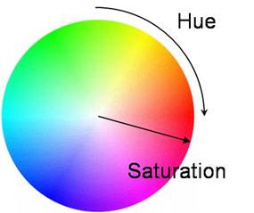

# colz-python
Port to Python 3 of **[colz](https://github.com/carloscabo/colz)** (color Javascript library to convert colors between RGB / Hex / HSL / HSV / HSB color spaces). **IMPORTANT: Colz always works internally and return results in floating point values except in methods specified.**

# Dependencies
It doesn't need any third-party dependencies / modules but `math`.

# Usage
You can create a color initializing the object a color, and it's equivalency other color formats:

````Python3
c1 = Colz()             # Create object
c1.setHex('#d32b46')    # Assing color
print( c1.r )           # Red component of the color (float)
print( c1.h )           # Hue component in the HSL format (float)
print( c1.rgba )        # Rgb format (list of floats)
print( c1.getRgbInt() ) # Rgb format (list of integers)
print( c1.hsl )         # Hsl format (list of floats)
````

Following all the color formats you can use to initialize the object, **Hex, RGB, RGBa, HSL, HSLa and HSV / HSB**

````Python3
# Hexadecimal colors ###########################################################

c1.setHex('#e')
c1.setHex('#edc')
c1.setHex('#d32b46')
c1.setHex('000')
c1.setHex('FFFfff')

# HSL both in float and integer values #########################################

c1.setHsl( 348, 42, 62 )
c1.setHsl( [ 348, 42, 62 ] ) # list
c1.setHsl( 0.9666666666666667, 0.42, 0.62 )
c1.setHsl( [ 0.9666666666666667, 0.42, 0.62 ] ) # list of float

# Integer components with float alpha
c1.setHsla( 348, 42, 62, 0.5 )
c1.setHsla( [ 348, 42, 62, 0.5 ] )

 # Float components with float alpha
c1.setHsla( 0.9666666666666667, 0.42, 0.62, 0.5 )
c1.setHsla( [ 0.9666666666666667, 0.42, 0.62, 0.5 ] )

# Create from RGB ##############################################################

c1.setRgb( 199, 117, 134 )
c1.setRgb( [ 199, 117, 134 ] )
c1.setRgb( 0.7803921568627451, 0.4588235294117647, 0.5254901960784314 )
c1.setRgba( [ 0.7803921568627451, 0.4588235294117647, 0.5254901960784314 ] )

c1.setRgba( 199, 117, 134, 0.35 ) # Integer components with float alpha
c1.setRgba( [ 199, 117, 134, 0.35 ] ) # Integer components with float alpha

c1.setRgba( 0.7803921568627451, 0.4588235294117647, 0.5254901960784314, 0.35 )
c1.setRgba( [ 0.7803921568627451, 0.4588235294117647, 0.5254901960784314, 0.35 ] )

# HSV / HSB, both in float and integer values ##################################

c1.setHsv( 348, 41, 78 )
c1.setHsv( [ 348, 41, 78 ] ) # list
c1.setHsv( 0.9666666666666667, 0.41, 0.78 )
c1.setHsv( [ 0.9666666666666667, 0.41, 0.78 ] ) #list
````

# Retrieving the color properties / components
Once the Colz object is created you can access the color components as properties of the object.

````Python3
c1 = Colz() # Create object
c1.setHex('#d32b46') # Assing an initial color

# Retrieving color components
print( c1.hex )
print( c1.r ) # Red component (float)
print( c1.g ) # Green component (float)
print( c1.b ) # Blue component (float)
print( c1.h ) # Hue component (float)
print( c1.s ) # Saturation component (float)
print( c1.l ) # Luminance component (float)
print( c1.a ) # Alpha component (float)

print( c1.rgb )  # rgb  color as list of (float) values
print( c1.rgba ) # rgba color as list of (float) values
print( c1.hsl )  # hsl  color as list of (float) values
print( c1.hsla ) # hsla color as list of (float) values
````

# Modifiying a HSL color component
HSL is a better color space to be understood by humans ( [read about it here](https://en.wikipedia.org/wiki/HSL_and_HSV) ). Some methods are provided to modify the color object based on HSL components. Using this methods you will update the whole color objet properties.

````Python3
c1 = Colz()
c1.setHsl( 348, 41, 78 )

c1.setHue( 0.95 )   # Update color hue [0 - 360] int or [0.0 - 1.0] float )
c1.setSat( 0.95 )   # Update color saturation [0 - 100] int or [0.0 - 1.0] float )
c1.setLum( 0.95 )   # Update color luminance [0 - 100] int or [0.0 - 1.0] float )
c1.setAlpha( 0.95 ) # Update color alpha [0.0 - 1.0] float )
````

# Getting colors as integers
**Colz** works internally in floating point, but in the case you need the integer values of the colors there are some helpers to get them.

````Python3
c1 = Colz()
c1.setHsl( 348, 41, 78 )

c1.getRgbInt() # Color as list of (int) values
c1.getHslInt() # Color as list of (int) values
c1.getHsvInt() # Color as list of (int) values
````

# _Rotating_ a color
If you imagine the HSL color space as a circle, you can _rotate_ a color by modifiying its HUE while keeping its saturation and luminosity values untouch, this is very useful for **armonic color transitions**.

````Python3
c1 = Colz()
c1.setRgb( 199, 117, 134 )
print( c1.h )

c1.rotateHue( -20 )   # Rotate CCW (counter-clockwise) using an int
print( c1.h )

# or also

c1.rotateHue( 0.055 ) # Rotate CW (clockwise) using a float
print( c1.h )
````

# Interpotaling 2 colors
`Colz.interpolate` is one of the more powerful functionallities of the module, it allows you to **interpolate (or _mix_) two colors, passing the _percent_ of each color you want in the final result** in the [0.0 - 1.0] range. **0.0** means _"0% of the second color"_ and **1.0** means _"100 % of the second color"_.

````Python3
c1 = Colz()
c1.setHsla( [ 0.75, 0.42, 0.62, 0.5 ] )
c2 = Colz()
c2.setHsla( [ 0.1, 0.62, 0.42, 0.1 ] )
cmix1 = Colz.interpolate( c1, c2, 0.5 ) # 0.5 -> 50% of each color
# Returns a list of flot values
````

You can use `Colz.interpolate` directly on color lists without the need of creating `Colz` objects too.

````
c1_values = [ 0.75, 0.42, 0.62, 0.5 ]
c2_values = [ 0.1, 0.62, 0.42, 0.1 ]
cmix1 = Colz.interpolate( c2_values, c1_values, 0.01 )
# Returns a list of flot values
````

# Static methods
You have several static methods on the class that can be used without the need of creating a **Colz object**. That could be useful in some projects, situatuations.

````Python3
rgb = Colz.hslToRgb( h, s, l ) # Returns list of float
rgb = Colz.hsvToRgb( h, s, v ) # Returns list of float
hsl = Colz.rgbToHsl( r, g, b ) # Returns list of float
hsl = Colz.hsvToHsl( h, v, v ) # Returns list of float
hsv = Colz.rgbToHsv( r, g, b ) # Returns list of float
hex = Colz.rgbToHex( r, g, b ) # Returns hex string without '#'

# also...

rgb = Colz.hslToRgb( [ h, s, l ] ) # Returns list of float
rgb = Colz.hsvToRgb( [ h, s, v ] ) # Returns list of float
hsl = Colz.rgbToHsl( [ r, g, b ] ) # Returns list of float
hsl = Colz.hsvToHsl( [ h, v, v ] ) # Returns list of float
hsv = Colz.rgbToHsv( [ r, g, b ] ) # Returns list of float
hex = Colz.rgbToHex( [ r, g, b ] ) # Returns hex string without '#'
````

# Getting teh colors in CSS string format
Helpers that provide the colors in CSS format, rgb, rgba, hsl, hsl1
````Python3
c1 = Colz()
print( c1.toRgbString() )
print( c1.toRgbaString() )
print( c1.toHslString() )
print( c1.toHslaString() )
````

# TO-DO
* Add color scheme creation.

# Changelog
* v0.1.0 (2016/06/05) First release
